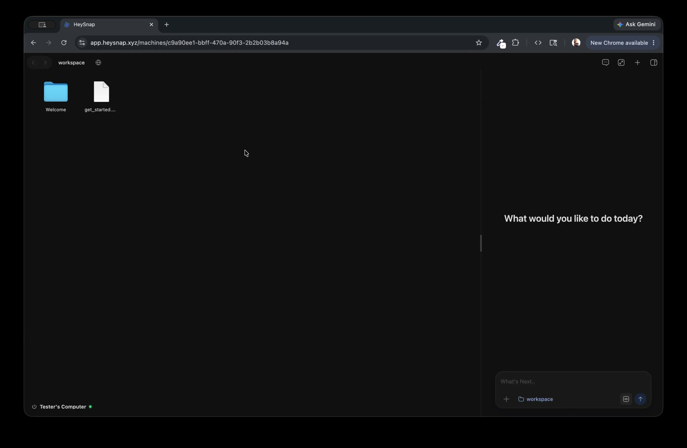
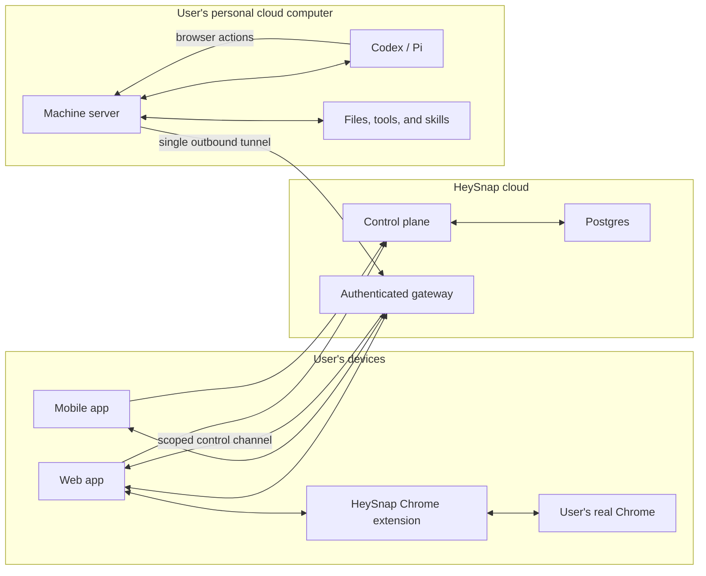

# HeySnap

### A personal, private AI computer for people who do not code.

Coding agents can already research, create files, use tools, and complete long
pieces of work. But most of them still assume that their user is a developer:
there are terminals everywhere, the machine needs to be configured, and useful
work stops as soon as the agent reaches a login screen.

HeySnap hides that machinery behind something people already understand—a
computer. Every user gets a persistent cloud machine, pre-configured with an
agent and the tools it needs. They work through a familiar filesystem, ask for
things in plain language, and watch the results appear as the agent works.

[**Watch the 3-minute demo →**](https://cedpcqallrtqmzdlqrst.supabase.co/storage/v1/object/public/ank1015-portfolio-media/heysnap-demo.mp4)
&nbsp;&nbsp;·&nbsp;&nbsp;
[**Read why I built HeySnap →**](https://www.ank1015.com/heysnap)

[](https://cedpcqallrtqmzdlqrst.supabase.co/storage/v1/object/public/ank1015-portfolio-media/heysnap-demo.mp4)

## What HeySnap feels like

### A computer, not a developer tool

The workspace is a live view of the user's cloud filesystem. They can browse
folders, open and preview files, drag in uploads, rename things, and download
results. Changes stream over WebSockets, so a document or folder created by the
agent appears immediately.

### An agent that can do the technical work

The agent runs on the same machine as the user's files and development tools.
HeySnap currently supports Codex and Pi behind a shared thread and streaming
protocol. The interface keeps the terminals and runtime details out of the way
while preserving agent history, tool activity, plans, attachments, voice input,
steering, and cancellation.

### The user's real browser

Useful work often depends on a browser that is already logged in to email,
accounts, and private services. HeySnap does not replace that browser with a
throwaway headless session.

Its Chrome extension connects the app to a managed window in the user's real
Chrome profile. The window is streamed into HeySnap, where the user can click
and type normally while the agent can navigate, inspect pages, take screenshots,
upload files, and save downloads back to the cloud computer. Existing cookies,
logins, two-factor prompts, and the user's own IP continue to work because the
browser genuinely belongs to them.

### Available beyond the desk

The React web app and Expo mobile app connect to the same persistent computer.
Files, agent threads, and—when enabled—the live browser surface remain available
from either client.

## How it works

Each user computer is an isolated Ubuntu VM. It keeps its filesystem and agent
state across sessions, sleeps when idle, and wakes when the user returns.



The control plane provisions machines, authenticates users, tracks lifecycle
state, and issues short-lived access sessions. A machine never exposes its
runtime port to the public internet. Instead, it dials outward to the gateway,
which multiplexes filesystem, preview, agent, and browser-control traffic over
one authenticated tunnel.

## Product capabilities

- **Persistent AI computers:** AWS EC2 provisioning, encrypted storage,
  machine registration, heartbeats, start/stop/restart, and automatic idle
  sleep.
- **Agent workspace:** Codex and Pi harnesses, resumable streaming runs, thread
  history, model selection, message editing, steering, cancellation, tool
  activity, plans, images, and file attachments.
- **Live filesystem:** create, rename, move, trash, upload, download, and watch
  files and folders over a root-scoped filesystem protocol.
- **Rich previews:** source code, Markdown, CSV, XLSX, DOCX, PPTX, PDF, images,
  audio, and video.
- **Browser collaboration:** real Chrome tabs, navigation, page inspection,
  screenshots, input, uploads, downloads, and mobile browser streaming.
- **Web and mobile clients:** shared access to the same computer from React and
  Expo applications, including voice prompt input.
- **Built-in tools and skills:** GitHub, Vercel, Supabase, image generation,
  Chrome, web research, documents, spreadsheets, presentations, PDFs, FFmpeg,
  and Remotion.
- **Operations:** user and machine administration, release management, machine
  health, agent-session synchronization, AI gatewaying, and per-user/per-machine
  usage and cost reporting.

## Engineering highlights

- **No public machine ports.** All remote access travels through a
  machine-initiated gateway tunnel with ownership checks and short-lived,
  route-scoped access tokens.
- **One tunnel, many protocols.** The tunnel carries WebSockets and streaming
  HTTP with per-route priorities, backpressure, queue limits, and heartbeats.
- **Safe machine updates.** Versioned host artifacts are checksummed, installed
  atomically, migrated once, restarted only when sessions are idle, health
  checked, and rolled back on failure.
- **Credentials stay centralized.** Cloud machines authenticate to HeySnap's AI
  and Firecrawl gateways with machine identity; upstream provider credentials
  do not need to be written to each VM.
- **The browser bridges two computers.** Agent commands originate on the cloud
  VM, travel through the tunnel to the web client and Chrome extension, and can
  move files between the VM and the user's browser.
- **Production-shaped local development.** Docker-backed machines preserve the
  same control-plane, bootstrap, release, gateway, and machine-server boundaries
  used in production.

## Repository map

| Path | Responsibility |
| --- | --- |
| `apps/web` | Vite + React browser application |
| `apps/mobile` | Expo + React Native mobile application |
| `packages/cloud-server` | Hono control plane, gateway, provisioning, auth, AI gateway, and admin API |
| `packages/cloud-server/admin-ui` | React administration and operations dashboard |
| `packages/server` | Per-machine filesystem, preview, agent, capability, browser-control, and tunnel runtime |
| `packages/machine-bootstrap` | Host installation, registration, heartbeat, release, and rollback scripts |
| `packages/tunnel-protocol` | Shared multiplexed tunnel protocol and scheduling primitives |
| `packages/previewer` | Standalone rich file-preview surface |
| `infra/machine-image` | Packer-built Ubuntu developer machine image |
| `scripts/local-dev` | Full local environment and Docker-machine workflow |

## Run locally

The complete local environment uses Docker machines while preserving the
production architecture.

```sh
pnpm install
pnpm dev:local
```

This starts Postgres, the cloud server, web app, admin UI, local artifact
publishing, and Docker-backed machine provisioning.

Open `http://127.0.0.1:5175` and sign in with:

```text
Email: dev@example.com
Password: dev123
```

Useful commands:

```sh
pnpm dev:local:status -- <computerId>
pnpm dev:local:logs -- <computerId>
pnpm dev:local:shell -- <computerId>
pnpm dev:local:release
pnpm dev:local:down
```

For the individual applications and services:

```sh
pnpm dev
pnpm dev:server
pnpm dev:cloud-server
pnpm dev:local:mobile
pnpm dev:local:admin
```

## Verify the workspace

```sh
pnpm typecheck
pnpm -r test
pnpm build
```

Backend checks also run on pull requests and pushes to `main`. Deployment and
release workflows separately publish the web app, cloud server, machine-server
artifacts, and base machine image.

## Documentation

- [`docs/architecture.md`](docs/architecture.md) — system model and security
  boundaries
- [`docs/system-wiring.md`](docs/system-wiring.md) — authentication, machine,
  gateway, and client flows
- [`docs/local-docker-machines.md`](docs/local-docker-machines.md) — complete
  local environment
- [`docs/cloud-server-vms.md`](docs/cloud-server-vms.md) — EC2 provisioning and
  machine lifecycle
- [`docs/distribution-and-updates.md`](docs/distribution-and-updates.md) —
  deployments, releases, and safe updates
- [`docs/admin-operations.md`](docs/admin-operations.md) — administration and
  operational workflows
- [`docs/browser-control-post-api.md`](docs/browser-control-post-api.md) —
  machine-to-browser control protocol

## Project status

HeySnap is an actively evolving product. The repository contains the complete
web, mobile, control-plane, gateway, machine-runtime, and infrastructure
implementation, but public signup is not currently enabled; users are created
through the administration surface.
